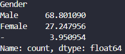
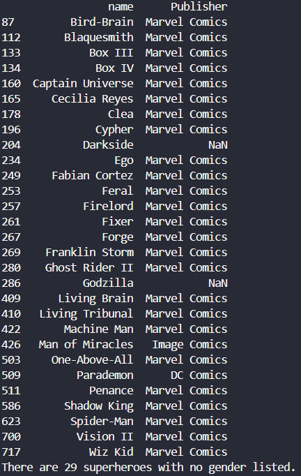
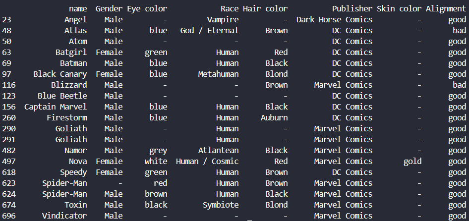

# Superhero Data Analysis

This is a repository for me to practice data science and analysis using the superhero datasets found at https://www.kaggle.com/datasets/claudiodavi/superhero-set/data

## Introduction

I am interested in learning more about data science concepts and I am a fan of superhero comic books. I have decided to practice data science techniques using data about comic book superheroes.

## Inspection of Datasets

I loaded the datasets into Pandas dataframes, and then I looked at the data. I have only worked with the heroes dataset, that is, the dataset "heroes_information.csv" found at the above link.

## Cleaning Heroes Dataset

What I have done to clean the heroes dataset was to drop the "Unnamed: 0" column, and also the "Height" and "Weight" columns in the dataset. I did this very similarly to how [a similar project](https://github.com/sergi0gs/Marvel_vs_DC/tree/main) cleaned the same dataset for analysis.

## Analysis of Heroes Dataset

One of the things I wanted to know about the superheroes was what percentage of them were male and what percentage were female.

These results show that about 68.8% of the characters in the dataset are male, about 27.2% are female, and about 4.0% have a gender listed as "-".

### Heroes With No Gender Listed

There were 29 superheroes in the dataset listed with a gender of "-".

### Duplicated Heroes

Looking at the list of these heroes, I saw some familiar names, including Spider-Man. This led me to check for heroes with duplicate names.

There are many familiar names in this list, including Batman and Spider-Man. Captain Marvel (DC Comics) is listed, which, for me, raises the question of "Is this listed as a duplicate of a Marvel Captain Marvel?" Let's see: